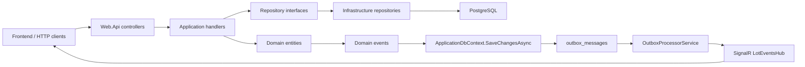
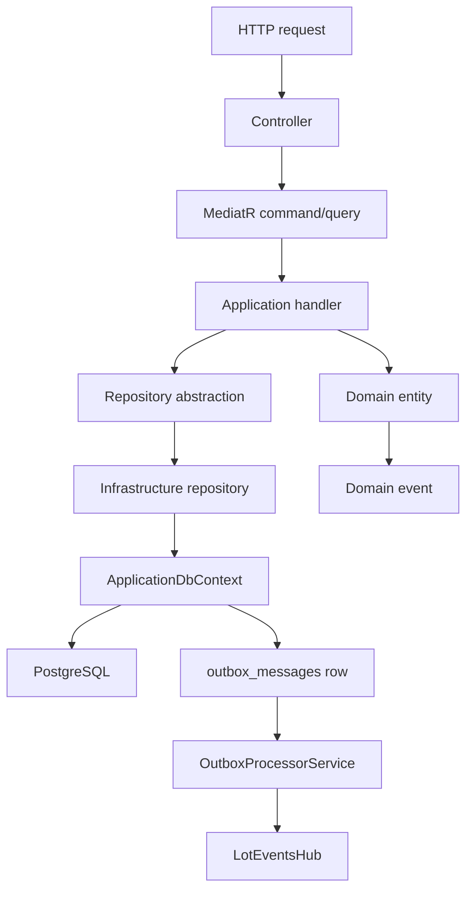
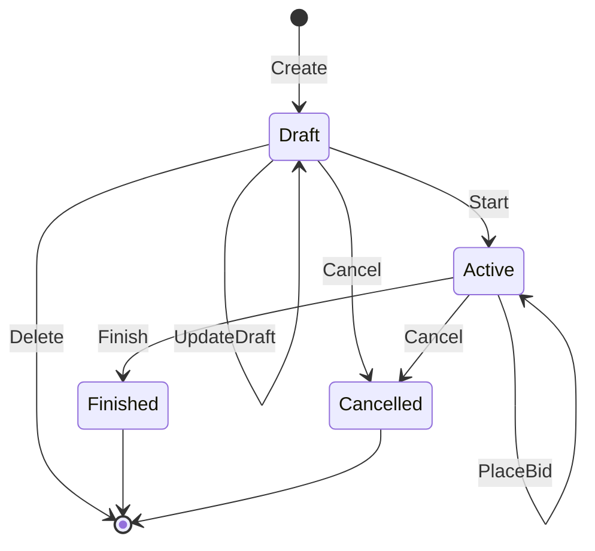
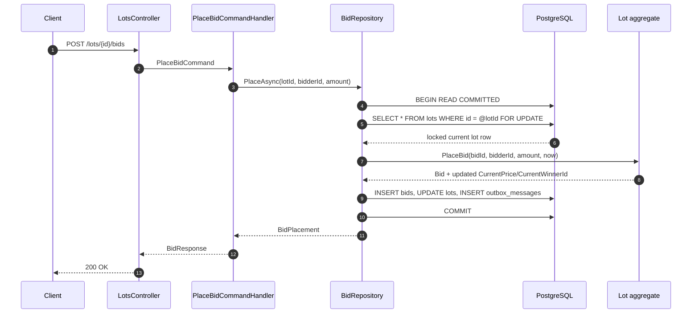
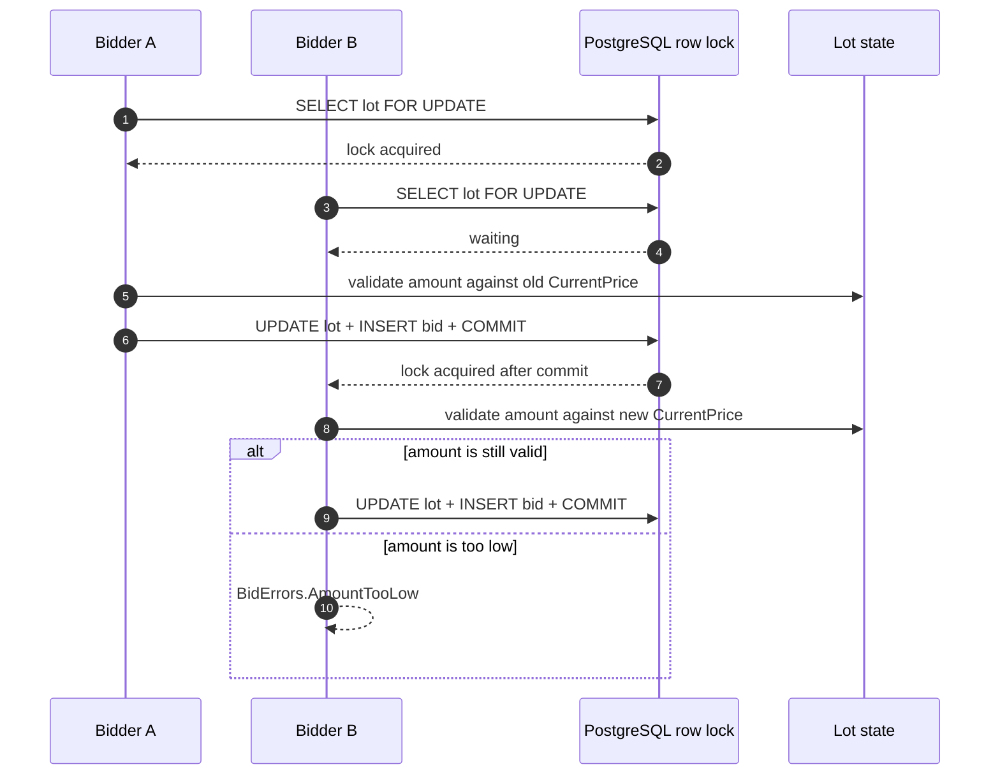
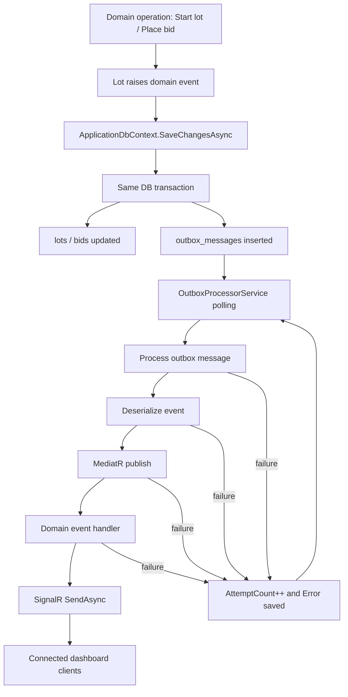
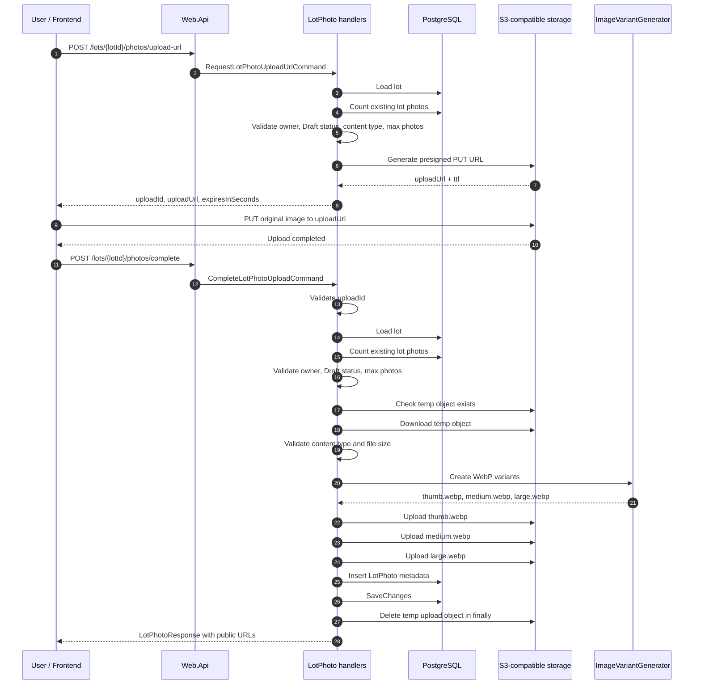
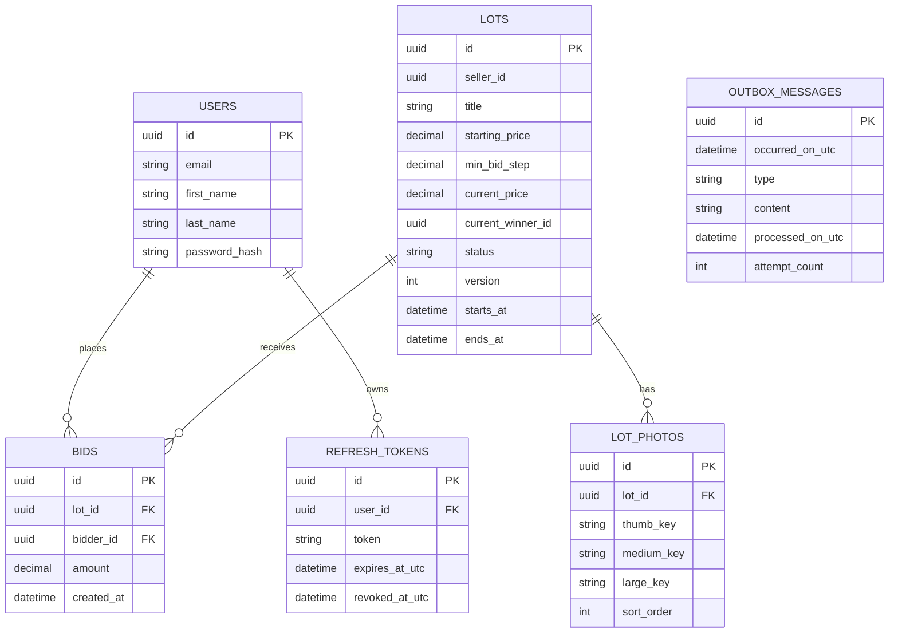
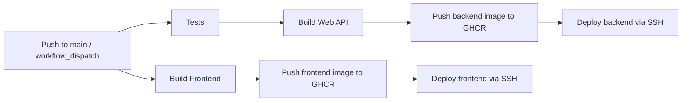

# Auction

Auction - клиент-серверное приложение для проведения онлайн-аукционов.

Система управляет лотами, ставками, пользователями, фотографиями лотов и real-time обновлениями состояния торгов. Основная конкурентная операция в backend - размещение ставки на активный лот, где несколько пользователей могут одновременно обновлять один и тот же ресурс.

## Tech Stack

### Backend

- ASP.NET Core
- Entity Framework Core
- PostgreSQL
- MediatR
- JWT authentication
- Refresh tokens
- SignalR
- Outbox pattern
- OpenTelemetry

### Frontend

- Vue
- Vite
- Vue Router
- Nginx для контейнерного запуска frontend

### Infrastructure

- Docker
- Docker Compose
- GitHub Actions
- GitHub Container Registry
- Aspire Dashboard для локального просмотра telemetry
- S3-compatible storage для изображений лотов

## Features

- Регистрация и аутентификация пользователей.
- Выдача JWT access token и refresh token.
- Ротация refresh token.
- Создание, обновление, запуск, завершение, отмена и удаление лотов.
- Размещение ставок на активные лоты.
- Проверка бизнес-инвариантов ставок в доменной модели.
- Конкурентная обработка ставок через row-level locking в PostgreSQL.
- Загрузка фотографий лотов через presigned URL.
- Генерация и хранение вариантов изображений.
- Real-time события по SignalR.
- Сохранение доменных событий через outbox pattern.
- Автоматическое применение EF Core migrations при старте backend.
- Docker Compose для локального запуска backend, frontend, PostgreSQL и Aspire Dashboard.
- GitHub Actions workflow для тестов, сборки, публикации Docker images и деплоя.

## Architecture

Backend разделен на слои:

| Слой | Назначение | Основные файлы |
| --- | --- | --- |
| `Domain` | Доменная модель и бизнес-правила | `src/Domain/**` |
| `Application` | Use cases, commands, queries, DTO и interfaces | `src/Application/**` |
| `Infrastructure` | EF Core, PostgreSQL, authentication, storage, SignalR, outbox, background services | `src/Infrastructure/**` |
| `Web.Api` | HTTP API, controllers, middleware, Swagger/OpenAPI, application startup | `src/Web.Api/**` |



Typical backend request flow:



Controllers принимают HTTP-запросы и отправляют commands/queries через MediatR. Application handlers выполняют сценарии использования, обращаются к доменной модели и используют interfaces репозиториев. Infrastructure реализует persistence, транзакции, authentication, object storage, outbox и real-time delivery.

## Domain Model

### Lot

`Lot` представляет лот аукциона и содержит:

- `Id`
- `SellerId`
- `Title`
- `Description`
- `StartingPrice`
- `MinBidStep`
- `CurrentPrice`
- `CurrentWinnerId`
- `Status`
- `StartsAt`
- `EndsAt`
- `Version`
- `CreatedAt`
- `UpdatedAt`

Статусы лота:

- `Draft` - лот создан, торги не запущены.
- `Active` - торги запущены, ставки разрешены.
- `Finished` - торги завершены.
- `Cancelled` - лот отменен.



Основные методы `Lot`:

- `Create` - создает лот в статусе `Draft`.
- `UpdateDraft` - обновляет данные лота только в статусе `Draft`.
- `Start` - переводит лот в статус `Active` и создает `LotStartedDomainEvent`.
- `Finish` - переводит активный лот в статус `Finished`.
- `Cancel` - переводит лот в статус `Cancelled`.
- `PlaceBid` - проверяет ставку, обновляет текущую цену и победителя, создает `BidPlacedDomainEvent`.

Поля состояния лота изменяются через методы доменной модели. Setters у ключевых свойств закрыты, поэтому изменение `Status`, `CurrentPrice`, `CurrentWinnerId` и `Version` выполняется через операции, которые проверяют инварианты.

### Bid

`Bid` представляет ставку пользователя:

- `Id`
- `LotId`
- `BidderId`
- `Amount`
- `CreatedAt`

Ставка создается внутри `Lot.PlaceBid`. Это связывает запись ставки с обновлением состояния лота.

### Domain Invariants

При размещении ставки проверяется:

- лот находится в статусе `Active`;
- торги еще не завершены;
- продавец не делает ставку на собственный лот;
- сумма ставки положительная;
- сумма ставки не меньше `CurrentPrice + MinBidStep`.

После успешной ставки:

- создается новая сущность `Bid`;
- `CurrentPrice` обновляется до суммы ставки;
- `CurrentWinnerId` обновляется до пользователя, сделавшего ставку;
- `Version` лота увеличивается;
- создается `BidPlacedDomainEvent`.

## Bid Concurrency

Размещение ставки выполняется в `Infrastructure.Bids.BidRepository.PlaceAsync`.

Для конкурентного обновления одного лота используется транзакция PostgreSQL и row-level locking:

```sql
SELECT * FROM lots WHERE id = @lotId FOR UPDATE
```

Алгоритм размещения ставки:

1. Открывается транзакция с уровнем изоляции `ReadCommitted`.
2. Лот читается из таблицы `lots` с `FOR UPDATE`.
3. PostgreSQL блокирует строку выбранного лота до завершения транзакции.
4. Backend вызывает `lot.PlaceBid(...)` на актуальном состоянии лота.
5. В рамках той же транзакции сохраняются обновленный лот, новая ставка и outbox-сообщение.
6. Транзакция завершается commit.



При двух одновременных ставках на один лот второй запрос ожидает освобождения row lock. После commit первой транзакции второй запрос читает обновленное состояние лота и проверяет сумму ставки относительно новой `CurrentPrice`.



`Lot.Version` настроен как EF Core concurrency token:

```csharp
builder.Property(x => x.Version).IsConcurrencyToken();
```

`BidRepository` также обрабатывает ошибки конкурентной записи PostgreSQL:

- `DeadlockDetected`
- `LockNotAvailable`
- `SerializationFailure`

При таких ошибках возвращается `BidErrors.ConcurrentChange`.

## Real-time Events

Real-time обновления доставляются через SignalR hub:

```text
/hubs/lots
```

Backend публикует события:

- `lotStarted`
- `bidPlaced`

События доставляются через outbox pattern:

1. Доменная операция создает domain event.
2. `ApplicationDbContext.SaveChangesAsync` собирает domain events из tracked entities.
3. Для каждого события создается запись в `outbox_messages`.
4. `OutboxProcessorService` периодически читает необработанные сообщения.
5. Сообщение десериализуется и публикуется через MediatR.
6. Event handler отправляет данные подключенным клиентам через SignalR.
7. После успешной обработки заполняется `ProcessedOnUtc`.
8. При ошибке обработки сообщения увеличивается `AttemptCount`, а текст ошибки сохраняется в `Error`.



Outbox-сообщение сохраняется вместе с изменением бизнес-данных. Доставка события в SignalR выполняется отдельно от HTTP request path.

## API Overview

Backend предоставляет HTTP API для следующих групп операций:

- authentication: регистрация, вход, обновление access token через refresh token;
- lots: создание, получение, обновление, запуск, завершение, отмена и удаление лотов;
- bids: размещение ставок на активные лоты;
- lot photos: получение presigned upload URL, завершение загрузки, получение, сортировка и удаление фото.

Закрытые операции требуют JWT bearer token. Управление лотом доступно продавцу лота. Ставка от продавца на собственный лот отклоняется доменной моделью.

Swagger/OpenAPI включается в development environment.

## Authentication

Authentication реализована через JWT access tokens и refresh tokens.

Основной поток:

1. Пользователь регистрируется или выполняет login.
2. Backend проверяет учетные данные.
3. Backend выдает JWT access token.
4. Backend создает refresh token и сохраняет его в PostgreSQL.
5. При refresh старый refresh token отзывается, создается новый refresh token и выдается новый access token.

Очистка устаревших refresh tokens выполняется фоновым сервисом `RefreshTokenCleanupService`.

JWT options читаются из секции `Jwt`. Для production-окружения значения конфигурации должны передаваться через environment variables или secrets.

## Lot Photos

Фотографии лотов хранятся в S3-compatible storage.

Backend управляет:

- ограничением количества фотографий на лот;
- ограничением размера файла;
- TTL presigned upload URL;
- созданием вариантов изображения;
- порядком отображения фотографий.

Сами бинарные файлы загружаются через presigned URL, а backend хранит ключи объектов и metadata в PostgreSQL.



## Data Storage

Для хранения данных используется PostgreSQL. Доступ к базе выполняется через Entity Framework Core.

Основные таблицы:



EF Core migrations находятся в:

```text
src/Infrastructure/Persistence/Migrations
```

При старте backend применяет migrations автоматически:

```csharp
dbContext.Database.Migrate();
```

## Observability

Backend подключает OpenTelemetry:

- ASP.NET Core instrumentation
- HTTP client instrumentation
- runtime metrics
- OTLP exporter
- OpenTelemetry logs

В `compose.yaml` поднимается `aspire-dashboard`. Backend отправляет telemetry через OTLP.

Локально dashboard доступен по адресу:

```text
http://localhost:18888
```

## Local Development

### Prerequisites

- Docker
- Docker Compose
- .NET SDK 10 для запуска backend без контейнера
- Node.js для запуска frontend без контейнера

### Backend

Backend project:

```text
src/Web.Api/Web.Api.csproj
```

Запуск тестов:

```bash
dotnet test Auction.slnx
```

Запуск backend без Docker требует доступного PostgreSQL и корректной конфигурации connection string, JWT и S3-compatible storage.

### Frontend

Frontend находится в:

```text
frontend-vue
```

Основные команды:

```bash
npm ci
npm run dev
npm run build
```

## Running with Docker

Локальный запуск всех сервисов выполняется командой:

```bash
docker compose up --build
```

Сервисы в `compose.yaml`:

- `postgres` - PostgreSQL database.
- `web.api` - ASP.NET Core backend.
- `frontend-vue` - Vue frontend через Nginx.
- `aspire-dashboard` - локальный dashboard для telemetry.

После запуска:

- backend API: `http://localhost:8080`
- frontend: `http://localhost`
- Aspire Dashboard: `http://localhost:18888`
- PostgreSQL: `localhost:5432`

Backend Dockerfile:

```text
src/Web.Api/Dockerfile
```

Frontend Dockerfile:

```text
frontend-vue/Dockerfile
```

Backend image использует multi-stage build:

1. restore/build выполняется в SDK image;
2. publish выполняется отдельным stage;
3. final image содержит runtime и опубликованное приложение.

## CI/CD



Workflow использует GHCR image names:

- `ghcr.io/${{ github.repository_owner }}/auction-web-api`
- `ghcr.io/${{ github.repository_owner }}/auction-frontend`
